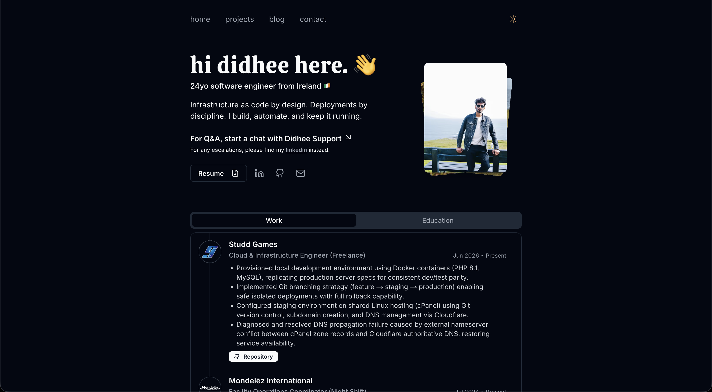

# My Personal Portfolio

A clean, minimal portfolio website built with Next.js, Tailwind CSS, and Shadcn UI. Features an email contact form, and blog.

## Live Demo

🌐 Check it out here: **[didheemose.dev](https://didheemose.dev)**



## Features

- Minimal design with Shadcn UI
- Light/dark mode toggle
- Contact form with email integration
- Responsive mobile design
- Blog section

## Tech Stack

### v1.0.0

- Next.js
- Tailwind CSS
- Shadcn UI
- Vercel (hosting)
- Resend (email)

### Main branch

- Next.js
- Tailwind CSS
- Shadcn UI
- Vercel (hosting)
- Resend (email)

## Getting Started

```bash
git clone https://github.com/tedawf/didheemose.dev my-portfolio
cd my-portfolio
git checkout tags/v1.0.0
npm install
cp .env.example .env.local
# add your API keys to .env.local
npm run dev
```

## Environment Variables

See .env.example

## Customization

- Update personal info in `src/data/*.json`
- Replace projects in `src/data/projects.json`
- Replace blog posts in `content/` or remove it.
- Replace your resume with `public/resume.pdf`

## Deployment

I prefer [Vercel](https://vercel.com/) for Next.js projects:

1. Push your fork to GitHub
2. Connect repo to Vercel
3. Add environment variables
4. Deploy 🎉

## Costs

- Vercel: Free
- Domain: ~$20/year
